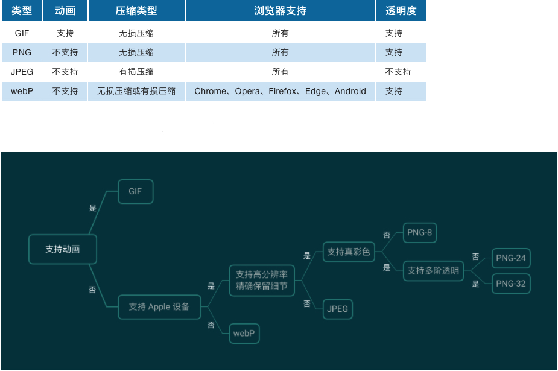

# 图像相关概念
## Web 中常用图格式
- **JPEG/JPG**(Joint Photographic Experts Group)：使用 JPEG 格式压缩的图片文件，是目前应用最广泛的图片格式之一。最普遍被使用的扩展名格式为.jpg，其他常用的扩展名还包括 .jpeg、.jpe、.jfif 以及 .jif。其特点是**有损压缩**，直接色，位图，体积最小，常用于颜色较丰富、无透明要求的图片。
- **PNG**(Portable Network Graphics)：PNG 是一种**无损压缩**的位图图形格式，支持索引、灰度、RGB 三种颜色方案以及 Alpha 通道等特性。PNG 的开发目标是改善并取代 GIF 作为适合网络传输的格式而不需专利许可。使用场景是带有透明、半透明背景的图片，需要在网络传输中显示预览效果后展示全貌。PNG 体积比较大，非必须可用 JPG 替代。PNG 有 png8、png24、png32 之分。
    - png8: 最多支持 256 色的 PNG，无损、索引色的位图。非动图可以替代 GIF，体积更小，透明度支持也更好。
    - png24： 最多支持 2^24 色的 PNG，不支持透明，无损、直接色的位图。目标是替换 JPG，但一般来说，相同显示效果，PNG 图片是 JPG 体积的数倍。
    - png32： 加上 8 位 Alpha 通道的 png24。（注：PS 中导出图片时选择 png24，勾选透明度，导出的是png32）。
- **GIF**(Graphics Interchange Format)：图像互换格式是一种位图图形文件格式，无损压缩、索引色。原始版本为 87a，1989 年发布 89a 版本，支持多帧动画和透明色。1995 年 Netscape Navigator 2.0 发布，定义了动画循环多少次或是否无限次播放，现在聊天的动图都是基于该版本的 GIF。GIF 的特性如下：
    - 优秀的 LZW 算法在保证质量的同时将体积变的更小。
    - 可插入多帧实现动画效果。
    - 可实现透明效果。
    - 最多支持 256 色，故不适用于真彩色图片。
- **WebP**：Google 2010 年发布的同时支持有损和无损压缩的图片文件格式。有损用来替换 JPG，无损用来替换PNG，动态用来替换 GIF。根据 Google 较早的测试，WebP 的无损压缩比网络上找到的 PNG 档少了 45％ 的文件大小，即使这些 PNG 档在使用 Pngcrush 和 PNGOUT 处理过，WebP 还是可以减少近 30％ 的文件体积。WebP 目前还不能全平台兼容，相关兼容性可点[此链接](https://caniuse.com/webp)查看。
- **SVG**(Scalable Vector Graphics)：可缩放矢量图形是一种基于可扩展编辑语言（XML），用于描述二维矢量图形的图形格式。SVG 由 W3C 制定，是一个开放标准。SVG 的优点是文件可读，易于修改编辑。支持多种滤镜和特殊效果，在不改变图像内容的前提下可以实现位图中类似文字阴影的效果，还可以生成动态图形。




## 图片缓存
浏览器和服务器之间使用的缓存策略可以分为强缓存、协商缓存两种：
- 强缓存：在缓存数据未失效的情况下，不需要再和服务器发生交互
- 协商缓存：需要与服务端校验是否使用缓存

使用`Cache-Control`的`max-age`指令可以定义资源有效期
使用`Etag`只有当服务器资源发生变动时才去请求


## 多倍图

在 Retina 视网膜屏幕面世之前人们很少关注像素密度与设备像素比，随着 Retina 屏在移动设备中越来越广泛地应用，为了保证图片在不同 DPR（设备像素比）的设备上显示足够清晰，开发者需要针对不同设备适配不同倍数的图片。

### 像素相关概念

- **DP** 设备像素，又名物理像素，即设备屏幕上真实的物理像素，以矩阵的形式排列，如 iphone X 屏幕分辨率为 2436*1125，即屏幕每行包含 1125 个物理像素，每列包含 2436 个物理像素。
- **DIP** 设备无关像素，是一种基于屏幕坐标的抽象像素，应用程序以抽象像素为单位，如我们 [CSS 中使用的 px](https://zhuanlan.zhihu.com/p/91636704) 就是相对于设备像素的一个相对单位，实际渲染时通过底层程序转换为物理像素。
- **DPR** 设备像素比，设备像素 / 设备无关像素的值即为设备像素比，在 Javascript 中可以通过 [window.devicePixelRatio](https://developer.mozilla.org/zh-CN/docs/Web/API/Window/devicePixelRatio) 来获取。

### 多倍图概念
- 在 DPR 为 1 的设备（一倍屏）上，使用 1 * 1 个物理像素展示一个 CSS 像素。
- 在 DPR 为 2 的设备（二倍屏）上，使用 2 * 2 个物理像素展示一个 CSS 像素。
- 在 DPR 为 3 的设备（三倍屏）上，使用 3 * 3 个物理像素展示一个 CSS 像素。

### 自适应 DPR 加载图片

#### 方法一：通过window.devicePixelRatio判断要加载几倍图
```
let url = photo.png
if (window.devicePixelRatio >= 3) {
    url = photo@3x.png
} else if (window.devicePixelRatio === 2) {
    url = photo@2x.png
}
```

### 方法二： 使用 img srcset 属性，除了 IE，现有主浏览器均已支持该属性。
```

```

### 方法三： 使用 CSS3 img-set 函数，兼容性参考[文档](https://caniuse.com/?search=image-set())
```
background-image: image-set("photo.png" 1x, "photo@2x.png" 2x, "photo@3x.png" 3x);
```

### 方法四： 使用 picture 标签，除了 IE，现有主浏览器均已支持该标签。
```
<picture>
  <source srcset="photo@3x.jpg" media="(min-width: 800px)">
  <source srcset="photo@2x.jpg" media="(min-width: 600px)">
  
</picture>
```

# 图像优化


# 参考
* [响应式图片](http://www.ruanyifeng.com/blog/2019/06/responsive-images.html)
* [为你重新系统梳理下， Web 体验优化中和图有关的那些事（万字长文）](https://www.zoo.team/article/picture)
* [CSS像素、物理像素、逻辑像素、设备像素比、PPI、Viewport](https://zhuanlan.zhihu.com/p/91636704)